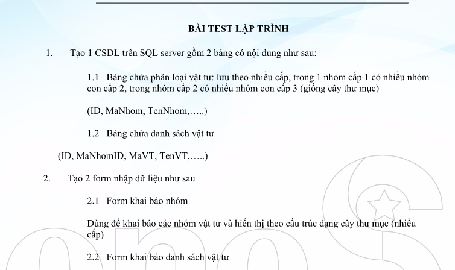
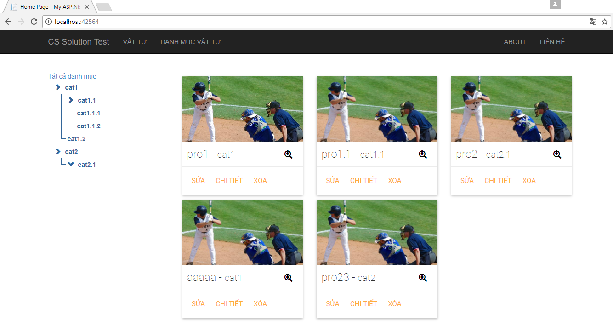

# OneSTest

A test project from CS Solution Company.
Using Visual Studio 2017: MVC 5 and Entity FrameWork 6.x

## Getting Started

Here is the exam:




### Installing

1. Restore Sql Server File in
choose Tasks -> Restore -> Database, in the dialog select From Device, then click the browse ellipsis, from there you get a browse dialog, click Add and then navigate to the back up file.
```
OneSTest\DbFile\DBCSSolutionTest.bak
```

2. Edit Web.config
change <connectionStrings> to your sql server connection string
```
OneSTest\Web.config
```

3. Run Project 


### Preview
1. Database Structure


2. Program live preview



## Built With

* [WEB MVC 5](https://docs.microsoft.com/en-us/aspnet/mvc/overview/getting-started/introduction/getting-started) - The web framework used
* [Entity Framework 6.x](https://docs.microsoft.com/en-us/ef/ef6/)
* [SQL SERVER](https://www.microsoft.com/en-us/download/details.aspx?id=42299)


## Authors

* **Hoang Dinh Cong** - [Info](http://hoangdinhcong.github.io/)
