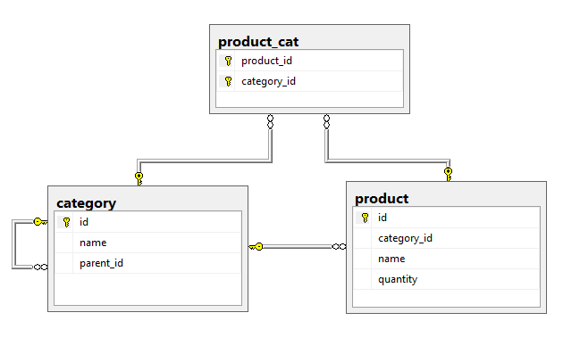

# OneSTest

A test project from CS Solution Company.
Using Visual Studio 2017: MVC 5 and Entity FrameWork 6.x

## Getting Started

Here is the exam:

> 1.       Tạo 1 CSDL trên SQL server gồm 2 bảng có nội dung như sau:
>	1.1   Bảng chứa phân loại vật tư: lưu theo nhiều cấp, trong 1 nhóm cấp 1 có nhiều nhóm con cấp 2, trong nhóm cấp 2 có nhiều nhóm con cấp 3 ( giống cây thư mục) - (ID, MaNhom, TenNhom,…..)
>	1.2   Bảng chứa danh sách vật tư - (ID, MaNhomID, MaVT, TenVT,…..)
> 2.       Tạo 2 form nhập dữ liệu như sau
>	2.1   Form khai báo nhóm, Dùng để khai báo các nhóm vật tư và hiển thị theo cấu trúc dạng cây thư mục (nhiều cấp)
>	2.2   Form khai báo danh sách vật tư


### Installing

1. Restore Sql Server File in
choose Tasks -> Restore -> Database, in the dialog select From Device, then click the browse ellipsis, from there you get a browse dialog, click Add and then navigate to the back up file.
```
OneSTest\DbFile\DBCSSolutionTest.bak
```

2. Edit Web.config
change <connectionStrings> to your sql server connection string
```
OneSTest\Web.config
```

3. Run Project 


### Preview
1. Database Structure


2. Program live preview


## Built With

* [WEB MVC 5](https://docs.microsoft.com/en-us/aspnet/mvc/overview/getting-started/introduction/getting-started) - The web framework used
* [Entity Framework 6.x](https://docs.microsoft.com/en-us/ef/ef6/)
* [SQL SERVER](https://www.microsoft.com/en-us/download/details.aspx?id=42299)


## Authors

* **Hoang Dinh Cong** - [Info](http://hoangdinhcong.github.io/)
